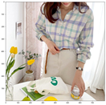

# environment

 - version
   	- gensim

# code 

1.  save_json_fashion.py
   - raw data 에서 전처리를 커쳐 input 을 json 형태로 저장합니다.
     (save name 설정 필요)
   
2.  doc2vec_fashion.py
   - doc2vec 을 사용하기 위한 모델 설계
   - doc2vec 모델 weight 저장 (path 설정)
   - 학습된 결과를 통해 topk 개의 추천 list 를 저장
   
3.  inference_fashion.py
   
   ```shell
   # json : input query json file
   # metadata : training model metadata (for recommend in it)
   # model : trained doc2vec model
   # topk : return item num
   python doc2vec_fashion.py --json example_jsonfile.json --metadata metadata.json --model doc2vec_model --topk 5 
   ```
   
   - input
     -  raw data 의 메타 정보
     -  학습된 모델의 메타정보 json file
     -  학습된 doc2vec 모델
     -  추천될 topk 수
   - 예시
     - input_list = ['셔츠', ''셔츠칼라'', ''루즈'', ''체크'','스커트','롱','데님']
     
     - output 
     
       
     
     

